# Cat_Craft README

***

## Overview
This project is my coursework, covering game physics collision, character behavior tree, simple AI state machine, automatic push-down machine, navigation pathfinding, line of sight detection, simple menu function and pause function score function,network function etc.

Here is my video link:

https://youtu.be/L_sykvCHags

---

## Game Objects in the World
1. **You[The Big Black Cat]:** The main controllable character navigated by the player.

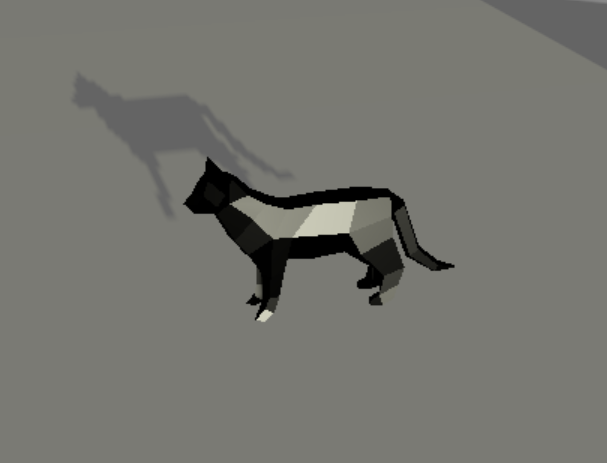

2. **Key:** Why a sphere? But he can open doors!

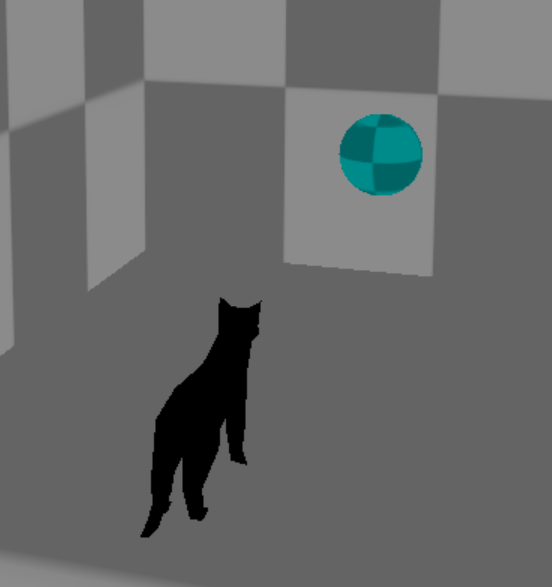

3. **Doors:** A light blue door opens an unexpected shortcut :)

   The color matches the key.

   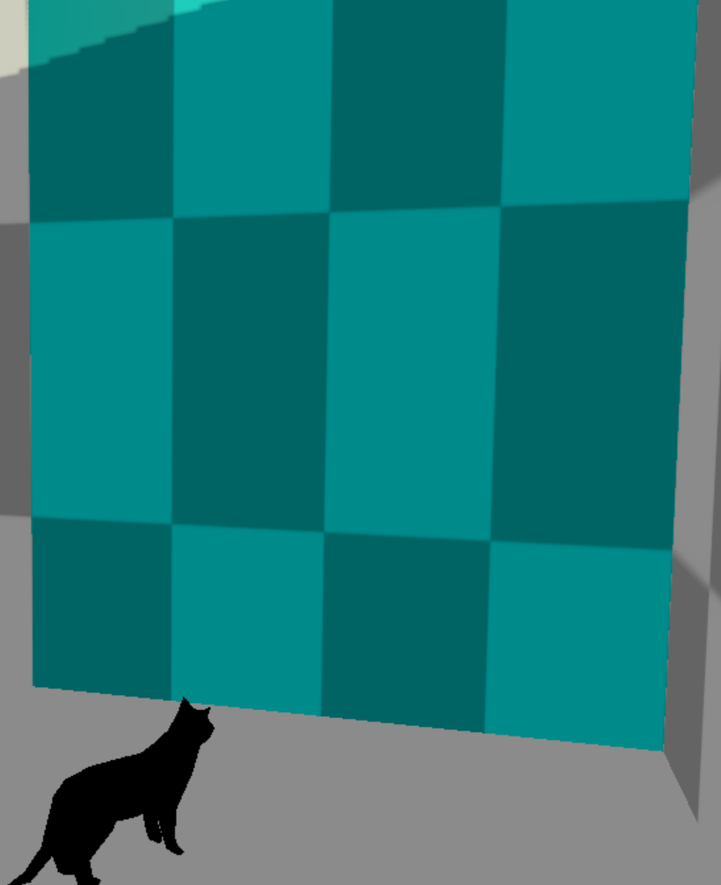

4. **Key holder**: The key holder will try to take your keys if you have them on you.

Normally he will ignore you but if you have the key he will get angry and turn red and try to get it from you.

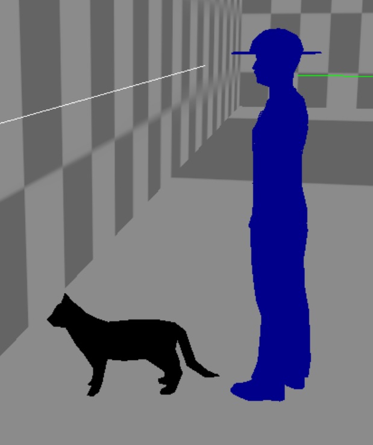

5. **Green Goose**: He is walking in his territory. Don't mess with him if you don't want to cause trouble. Friendly reminder: this goose can fly

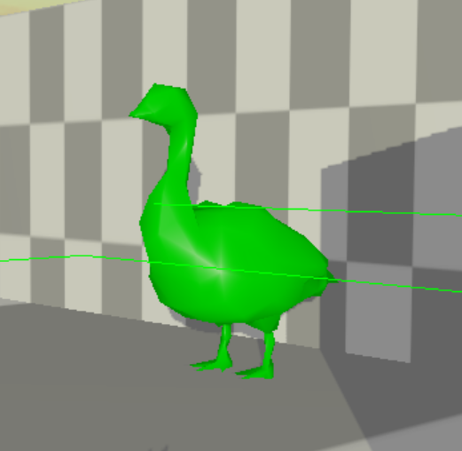

6. **Super Bonus!**: After you get him, he will give you a powerful hook-like ability to let you quickly get rid of the enemy's pursuit

   

7. **Kitten**: Poor little cat, he got lost in the giant goose's territory, help them get home

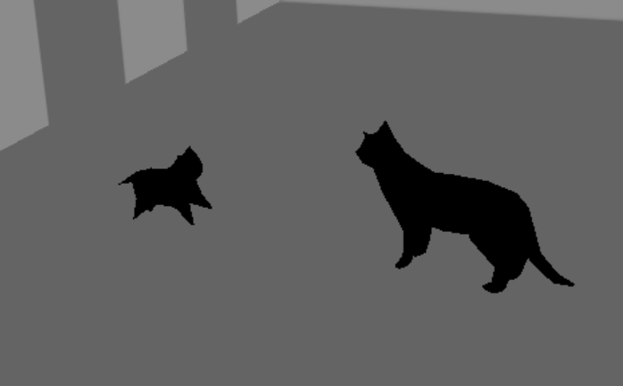

8. **Your Home**: The exit of the maze, your destination

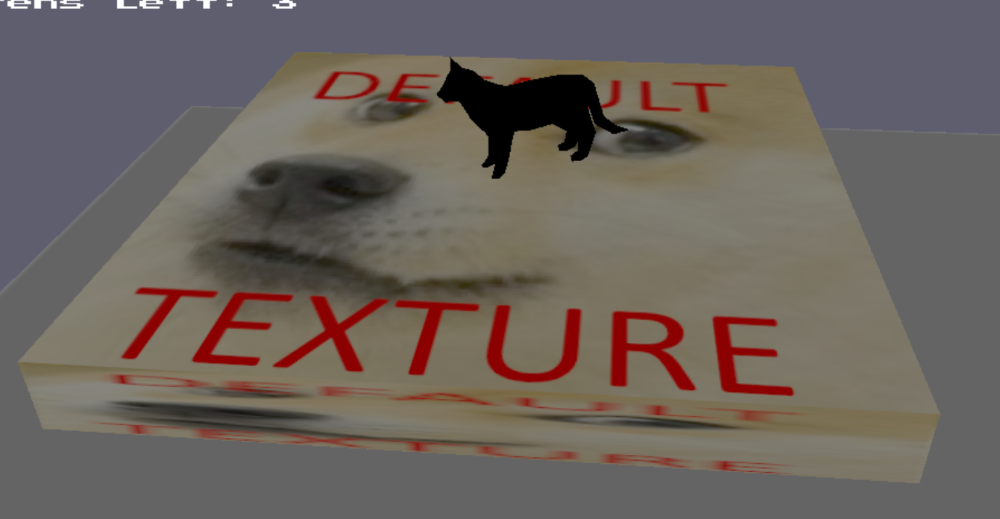

9. **Your Friend: ** Helps you freeze enemies or find keys to open doors

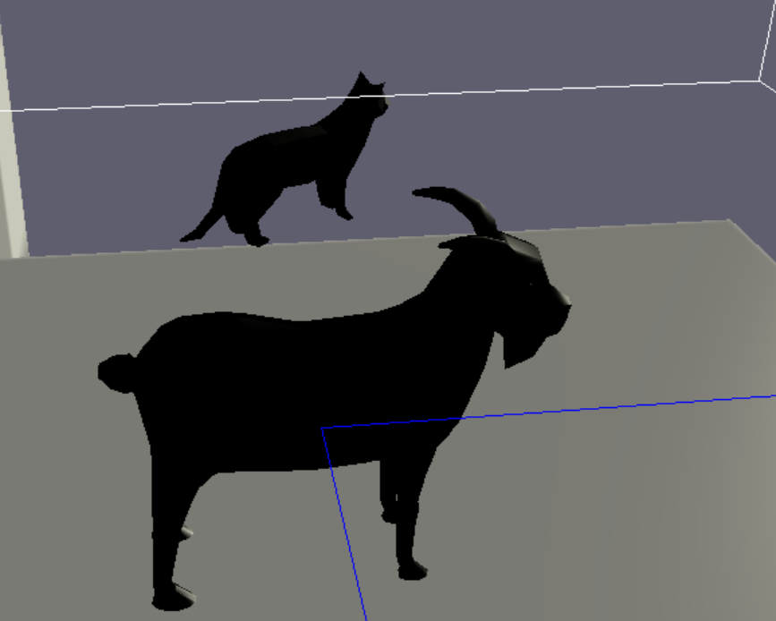

---

## Player Controls
- **Movement:**
  - **W/A/S/D:** Move the player character forward, left, backward, and right.
  - **Mouse:** Rotate the camera to change the direction of movement.
- **Interaction:**
  - **Left Mouse Button:** Activate Hook ability, if you get the super bonus
  - **F5**: Call your friends to help you.
- **Menu Control:**
  - **P:** to pause the game and access options.
  - **ESC:** to exit the game
  - **UP & DOWN:** Choose your options in menu
  - **F1:** Reset your game right now! 

---

## Game final goal
### Win goal:

Find all three kittens (default) in the maze within 120 seconds (default) and reach the end of the game to be considered successful. 

The score depends on the number of kittens and the remaining time.

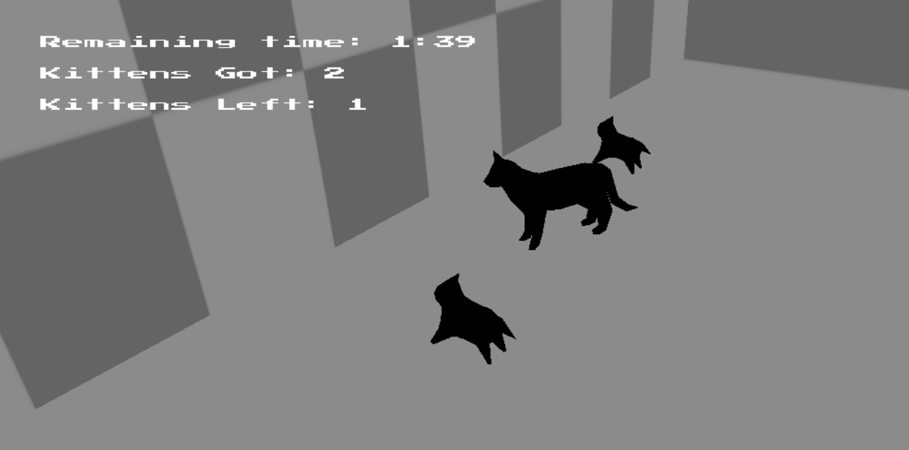

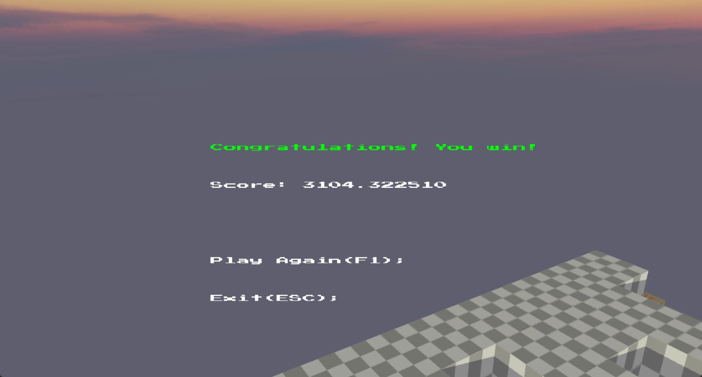

### Lose:

1. Caught by the Goose

2. Time is running out

3. The player's Y axis is less than 30.0f

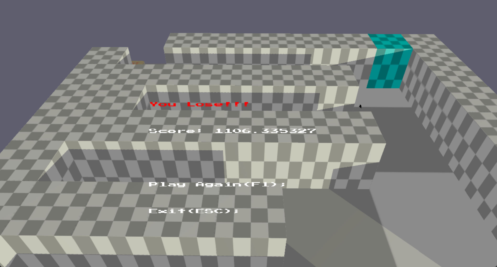

### Precautions:

A flying goose

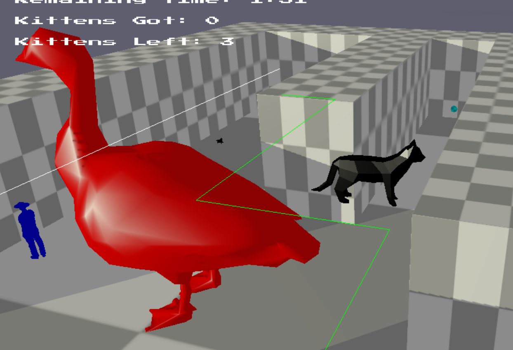

A farmer who grabs keys

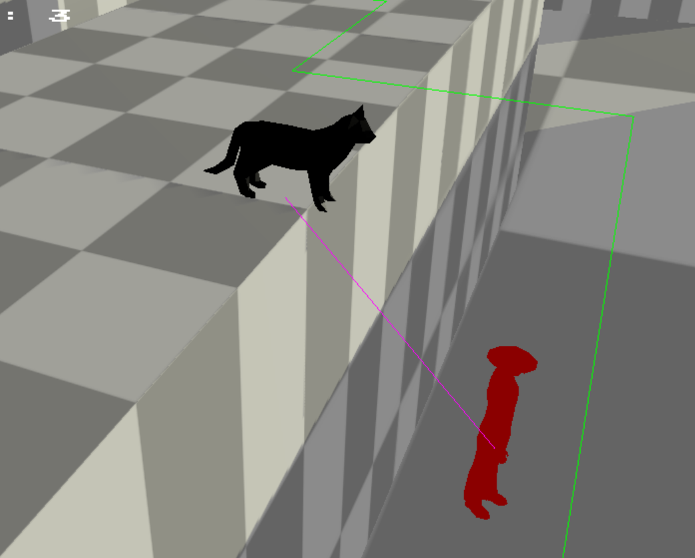

A friend who helps you find your keys

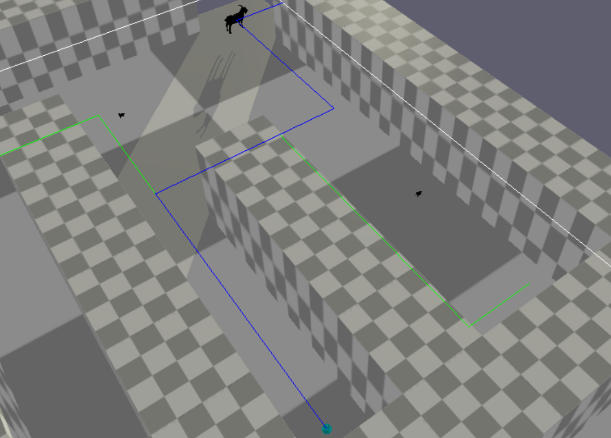

